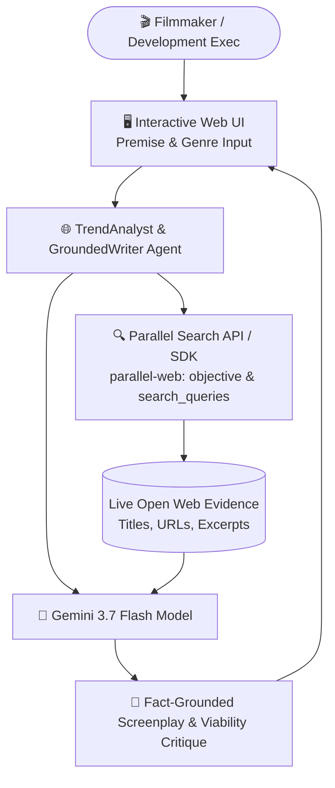

# 🏗️ CineIntel Engine — Architecture Whitepaper (Parallel Track)

## 1. System Overview
**CineIntel Engine** is an autonomous film research and script grounding platform that implements official Parallel Search and Gemini integration paths. Before production greenlights, autonomous agents ground screenplay development in verifiable evidence and explicit uncertainty bounds.

---

## 2. End-to-End Execution Flow
1. **Premise Input**: User provides a creative film brief and genre.
2. **Parallel Search Crawl**: Executes search via `AsyncParallel.search(objective=..., search_queries=[...])` or direct HTTP (`x-api-key`) to retrieve open-web excerpts.
3. **Source Evidence Preservation**: Retains verifiable source titles, URLs/fixture IDs, and excerpts without fabrication.
4. **Gemini 3.7 Flash Synthesis**: Deconstructs research into a grounded concept, recommended scene beats, and an explicit uncertainty rating.
5. **UI Display**: Renders source evidence cards, grounded screenplay treatment, measured latency, and explicit execution mode.
